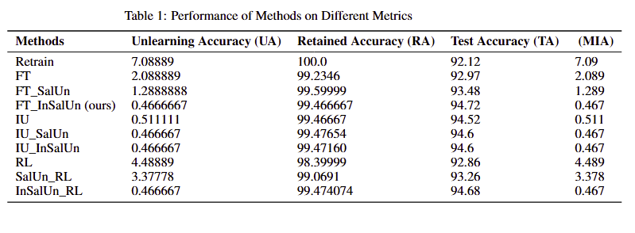

# IDL-Project: Enhancing Machine Unlearning Precision through Integrated Gradient Saliency in Multi-class Image Classification Models

**Contact**: Enhancing Machine Unlearning Precision through Integrated Gradient Saliency in Multi-class Image Classification Models

**Contributors**:
* Atabonfack Bernes {batabonf@andrew.cmu.edu }
* Olatunji Damilare E. {dolatunj@andrew.cmu.edu}  
* Pierre Ntakirutimana  {pntakiru@andrew.cmu.edu}   
* Tanghang Elvis Tata  {etanghan@andrew.cmu.edu}


## General concept: 

# Enhancing Machine Unlearning Precision through Integrated Gradient Saliency in Multi-class Image Classification Models

## General Concept
Machine learning has become a cornerstone in solving complex societal and engineering problems, including image recognition and content generation. However, privacy concerns and data governance policies, such as GDPR's "right to be forgotten," demand models to efficiently forget specific data without full retraining. Machine unlearning addresses this need by selectively erasing learned information while maintaining overall model performance.

## Abstract
We present an **Integrated Gradient Saliency** framework to improve machine unlearning in multi-class image classification models. Traditional methods rely on retraining, which is computationally expensive and impractical for real-time applications. Our approach integrates gradient saliency over the model's entire path and applies a thresholding mechanism to efficiently isolate and remove the contributions of the forgotten dataset. This method minimizes changes to model weights while preserving accuracy for non-targeted tasks, offering a robust, scalable solution for privacy-preserving AI.

## Our Idea
To address the limitations of retraining-based unlearning, we propose an **adaptive gradient saliency framework** that:
- Identifies and modulates the most impactful gradients linked to the data to be forgotten.
- Ensures computational efficiency by avoiding full retraining.
- Maintains model robustness, stability, and accuracy in multi-class scenarios.
- Advances data-driven model management aligned with ethical AI practices.

Through extensive evaluations, our framework demonstrates precision in unlearning and robustness against relearning attacks, setting a new standard for scalable, privacy-focused machine learning.

<table align="center">
  <tr>
    <td align="center"> 
       
      <br>
      <em style="font-size: 18px;">  <strong style="font-size: 18px;">Figure 2:</strong>  Overview of our machine unlearning technique (SalUn).</em>
    </td>
  </tr>
</table>

## Results and Discussion
The results from the experiments that we did are given in the table below 1 as InSalUn_RL at the end of table Our unlearning model shows an accuracy of 0.466 and it very close to IU_SalUn and test accuracy of 94.68 and this is very close to our suggested algorthm.

<table align="center">
  <tr>
    <td align="center"> 
       
      <br>
      <em style="font-size: 18px;">  <strong style="font-size: 18px;">Figure 3:</strong> Performance of Methods on Different Metrics.</em>
    </td>
  </tr>
</table>
    
The code structure of this project is adapted from the https://github.com/OPTML-Group/Unlearn-Saliency codebase.
For this project we Added a new script **new_generate_mask.py** that applies integrated gradient to obtain the salient weigts and biases used during unlearning 

## Requirements
```bash
pip install -r requirements.txt
```

## Scripts
1. Get the origin model.
    ```bash
    python main_train.py --arch {model name} --dataset {dataset name} --epochs {epochs for training} --lr {learning rate for training} --save_dir {file to save the orgin model}
    ```

    A simple example for ResNet-18 on CIFAR-10.
    ```bash
    python main_train.py --arch resnet18 --dataset cifar10 --lr 0.013 --epochs 182
    ```

2. Generate Saliency Map
    ```bash
    python new_generate_mask.py --save_dir ${saliency_map_path} --model_path ${origin_model_path} --num_indexes_to_replace ${forgetting data amount} --unlearn_epochs 1
    ```

3. Unlearn
    *  InSalUn
    ```bash
    python main_random.py --unlearn RL --unlearn_epochs ${epochs for unlearning} --unlearn_lr ${learning rate for unlearning} --num_indexes_to_replace ${forgetting data amount} --model_path ${origin_model_path} --save_dir ${save_dir} --mask_path ${saliency_map_path}
    ```

    A simple example for ResNet-18 on CIFAR-10 to unlearn 10% data.
    ```bash
    python main_random.py --unlearn RL --unlearn_epochs 10 --unlearn_lr 0.013 --num_indexes_to_replace 4500 --model_path ${origin_model_path} --save_dir ${save_dir} --mask_path mask/with_0.5.pt
    ```

    To compute UA, we need to subtract the forget accuracy from 100 in the evaluation results. As for MIA, it corresponds to multiplying SVC_MIA_forget_efficacy['confidence'] by 100 in the evaluation results. For a detailed clarification on MIA, please refer to Appendix C.3 at the following link: https://arxiv.org/abs/2304.04934.


    * Retrain
    ```bash
    python main_forget.py --save_dir ${save_dir} --model_path ${origin_model_path} --unlearn retrain --num_indexes_to_replace ${forgetting data amount} --unlearn_epochs ${epochs for unlearning} --unlearn_lr ${learning rate for unlearning}
    ```

    * FT
    ```bash
    python main_forget.py --save_dir ${save_dir} --model_path ${origin_model_path} --unlearn FT --num_indexes_to_replace ${forgetting data amount} --unlearn_epochs ${epochs for unlearning} --unlearn_lr ${learning rate for unlearning}
    ```

   * FT with Integrated Saliency
    ```bash
   python main_random.py --unlearn FT --unlearn_epochs ${epochs for unlearning} --unlearn_lr ${learning rate for unlearning} --num_indexes_to_replace ${forgetting data amount} --model_path ${origin_model_path} --save_dir ${save_dir} --mask_path ${saliency_map_path}
    ```

    * IU
    ```bash
    python -u main_forget.py --save_dir ${save_dir} --model_path ${origin_model_path} --unlearn wfisher --num_indexes_to_replace ${forgetting data amount} --alpha ${alpha}
    ```

   * IU with Integrated Saliency
    ```bash
     python main_random.py --unlearn wfisher --unlearn_epochs ${epochs for unlearning} --unlearn_lr ${learning rate for unlearning} --num_indexes_to_replace ${forgetting data amount} --model_path ${origin_model_path} --save_dir ${save_dir} --mask_path ${saliency_map_path} --alpha ${alpha}


# Extra material on how to use Integrated Gradients (IG)
Integrated Gradients is a systematic technique that attributes a deep model's prediction to its base features. For instance, an object recognition network's prediction to its pixels or a sentiment model's prediction to individual words in the sentence.The technique is based on the [paper](http://proceedings.mlr.press/v70/sundararajan17a/sundararajan17a.pdf) at ICML'17, a top tier machine learning conference.

[Variants ](https://arxiv.org/abs/1805.12233)of IG can be used to apply the notion of attribution to neurons.

That said, IG does not uncover the logic used by the network to combine features, though there are variants of IG that can do this in a limited sense.

*  Implementation of integration via summing the gradients is well explained in the paper [paper](http://proceedings.mlr.press/v70/sundararajan17a/sundararajan17a.pdf).)


## Cite This Work
```
@article{fan2023salun,
  title={Saliency-Unlearning With Integrated Gradient},
  author={Atabonfack Bernes and Tanghang Elvis Tata and Olatunji Damilare E and Pierre Ntakirutimana},
  journal={},
  year={}
}
```
