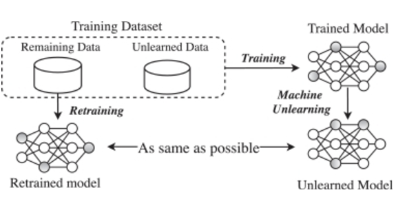

# IDL-Project: Saliency-Unlearning With Integrated Gradient

**Contact**: Saliency-Unlearning With Integrated Gradient

**Contributors**:
* Atabonfack Bernes {batabonf@andrew.cmu.edu }
* Olatunji Damilare E. {dolatunj@andrew.cmu.edu}  
* Pierre Ntakirutimana  {pntakiru@andrew.cmu.edu}   
* Tanghang Elvis Tata  {etanghan@andrew.cmu.edu}


## General concept: 


## Abstract: 

Amidst growing demands for privacy-preserving AI solutions and regulatory compliance [1] [2], machine unlearning has emerged as a critical frontier, enabling models to selectively erase learned information without compromising performance. With privacy regulations such as the General Data Protection Regulation (GDPR) granting individuals the "right to be forgotten", it has become essential to develop machine unlearning capabilities that allow users to remove their data from trained models efficiently and effectively [3], [4]. Conventional unlearning methods, which rely heavily on retraining, are inherently limited: they are computationally intensive, time-consuming, unstable, and often degrade model performance, making them impractical for real-world applications that demand rapid, targeted data removal [5], [6], [7]. This shortfall highlights an urgent research gap: the need for unlearning methods that not only handle specific data removal efficiently but also maintain model robustness, stability and accuracy in complex, multi-class scenarios.

<table align="center">
  <tr>
    <td align="center"> 
       
      <br>
      <em style="font-size: 18px;">  <strong style="font-size: 18px;">Figure 2:</strong>  Overview of our machine unlearning technique (SalUn).</em>
    </td>
  </tr>
</table>

    
The code structure of this project is adapted from the https://github.com/OPTML-Group/Unlearn-Saliency codebase.
For this project we Added a new script **new_generate_mask.py** that applies integrated gradient to obtain the salient weigts and biases used during unlearning 

## Requirements
```bash
pip install -r requirements.txt
```

## Scripts
1. Get the origin model.
    ```bash
    python main_train.py --arch {model name} --dataset {dataset name} --epochs {epochs for training} --lr {learning rate for training} --save_dir {file to save the orgin model}
    ```

    A simple example for ResNet-18 on CIFAR-10.
    ```bash
    python main_train.py --arch resnet18 --dataset cifar10 --lr 0.013 --epochs 182
    ```

2. Generate Saliency Map
    ```bash
    python new_generate_mask.py --save_dir ${saliency_map_path} --model_path ${origin_model_path} --num_indexes_to_replace ${forgetting data amount} --unlearn_epochs 1
    ```

3. Unlearn
    *  InSalUn
    ```bash
    python main_random.py --unlearn RL --unlearn_epochs ${epochs for unlearning} --unlearn_lr ${learning rate for unlearning} --num_indexes_to_replace ${forgetting data amount} --model_path ${origin_model_path} --save_dir ${save_dir} --mask_path ${saliency_map_path}
    ```

    A simple example for ResNet-18 on CIFAR-10 to unlearn 10% data.
    ```bash
    python main_random.py --unlearn RL --unlearn_epochs 10 --unlearn_lr 0.013 --num_indexes_to_replace 4500 --model_path ${origin_model_path} --save_dir ${save_dir} --mask_path mask/with_0.5.pt
    ```

    To compute UA, we need to subtract the forget accuracy from 100 in the evaluation results. As for MIA, it corresponds to multiplying SVC_MIA_forget_efficacy['confidence'] by 100 in the evaluation results. For a detailed clarification on MIA, please refer to Appendix C.3 at the following link: https://arxiv.org/abs/2304.04934.


    * Retrain
    ```bash
    python main_forget.py --save_dir ${save_dir} --model_path ${origin_model_path} --unlearn retrain --num_indexes_to_replace ${forgetting data amount} --unlearn_epochs ${epochs for unlearning} --unlearn_lr ${learning rate for unlearning}
    ```

    * FT
    ```bash
    python main_forget.py --save_dir ${save_dir} --model_path ${origin_model_path} --unlearn FT --num_indexes_to_replace ${forgetting data amount} --unlearn_epochs ${epochs for unlearning} --unlearn_lr ${learning rate for unlearning}
    ```

   * FT with Integrated Saliency
    ```bash
   python main_random.py --unlearn FT --unlearn_epochs ${epochs for unlearning} --unlearn_lr ${learning rate for unlearning} --num_indexes_to_replace ${forgetting data amount} --model_path ${origin_model_path} --save_dir ${save_dir} --mask_path ${saliency_map_path}
    ```

    * IU
    ```bash
    python -u main_forget.py --save_dir ${save_dir} --model_path ${origin_model_path} --unlearn wfisher --num_indexes_to_replace ${forgetting data amount} --alpha ${alpha}
    ```

   * IU with Integrated Saliency
    ```bash
     python main_random.py --unlearn wfisher --unlearn_epochs ${epochs for unlearning} --unlearn_lr ${learning rate for unlearning} --num_indexes_to_replace ${forgetting data amount} --model_path ${origin_model_path} --save_dir ${save_dir} --mask_path ${saliency_map_path} --alpha ${alpha}


# Extra material on how to use Integrated Gradients (IG)
Integrated Gradients is a systematic technique that attributes a deep model's prediction to its base features. For instance, an object recognition network's prediction to its pixels or a sentiment model's prediction to individual words in the sentence.The technique is based on the [paper](http://proceedings.mlr.press/v70/sundararajan17a/sundararajan17a.pdf) at ICML'17, a top tier machine learning conference.

[Variants ](https://arxiv.org/abs/1805.12233)of IG can be used to apply the notion of attribution to neurons.

That said, IG does not uncover the logic used by the network to combine features, though there are variants of IG that can do this in a limited sense.

*  Implementation of integration via summing the gradients is well explained in the paper [paper](http://proceedings.mlr.press/v70/sundararajan17a/sundararajan17a.pdf).)


## Cite This Work
```
@article{fan2023salun,
  title={Saliency-Unlearning With Integrated Gradient},
  author={Atabonfack Bernes and Tanghang Elvis Tata and Olatunji Damilare E and Pierre Ntakirutimana},
  journal={},
  year={}
}
```
